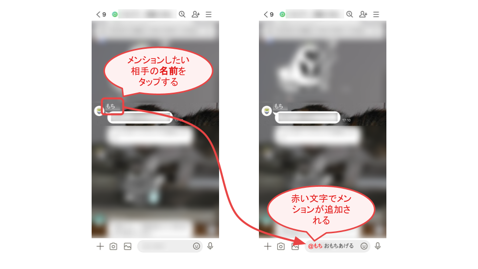
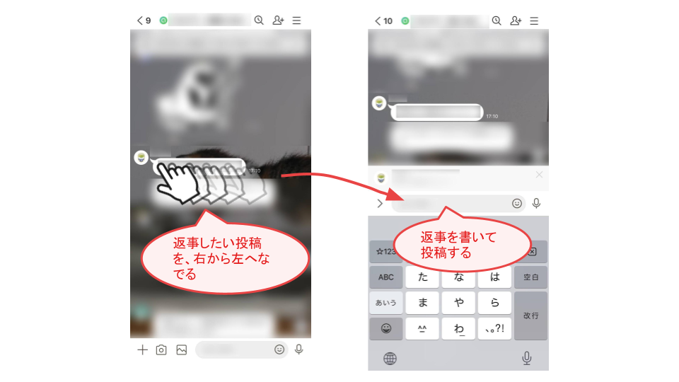
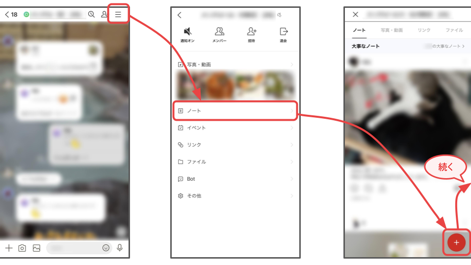
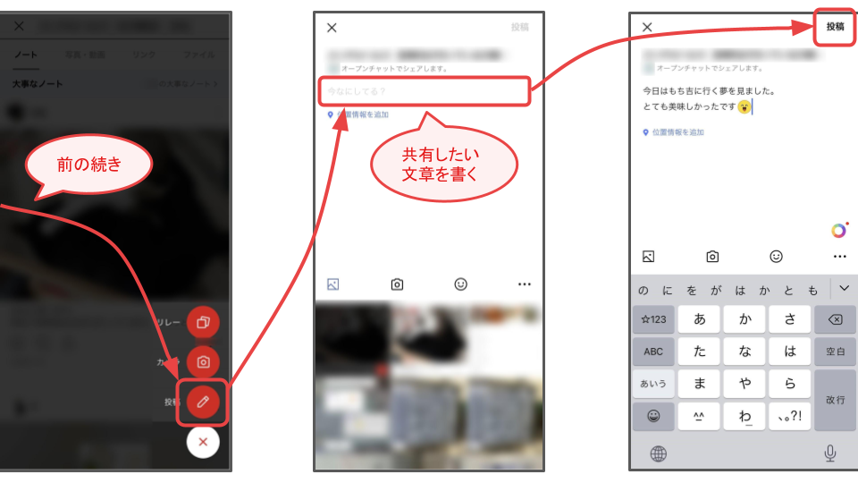

<link rel="stylesheet" href="https://kusa-mochi.github.io/line-open-chat-faq/css/common.css" />

# オープンチャットの基本

## もくじ
1. [用語](#words)
1. [操作方法](#operations)
    1. [メンションの仕方](#how-to-mention)
    1. [リプライの仕方](#how-to-reply)
    1. [ノートの書き方](#how-to-create-note)

## 用語

### メンション

話しかけたい相手のスマホに通知を出す機能。

メンションを付けて投稿すると、相手は自分に話しかけられたことが分かる。ただし、**注1**

### リプライ

日本語で「返事」のこと。

チャットのある投稿に対する返事という形で投稿できる。

メンションと同様に、相手のスマホに通知が出て、相手は自分に話しかけられたことが分かる。ただし、**注1**

### ノート

文章、画像、リンクなどをチャットメンバーの皆に共有する機能。

チャットよりも更新頻度が低めなので、後から見返したり新しく参加してきた人が読んだりできる。

### 大事なノート

オープンチャットの管理人のみが作成できるノート。

### ROM

チャットを読むだけで投稿しないこと。「ロム」と読む。

Read Only Memberの略。

**注1**：*複数のメンションやリプライの通知が来た状態でチャットを開くと、「あれ？全部で何件の通知が来たんだっけ？」と分からなくなり、メンションやリプライを見落としてしまうことはよくある。メンションやリプライをしたからといって、必ず読まれるとは限らないので注意。*

## 操作方法

### メンションの仕方

下図の手順でメンションを追加したら、いつも通り文を書いて投稿する。

メンションは複数人を指定できる。

文の途中にもメンションを追加できる。

### リプライの仕方

### ノートの書き方

